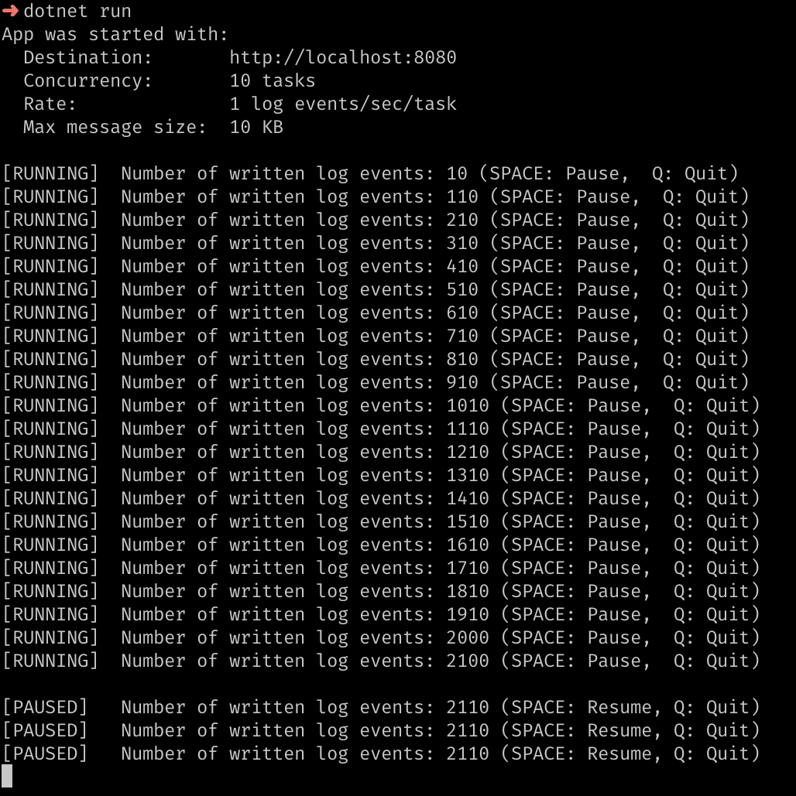
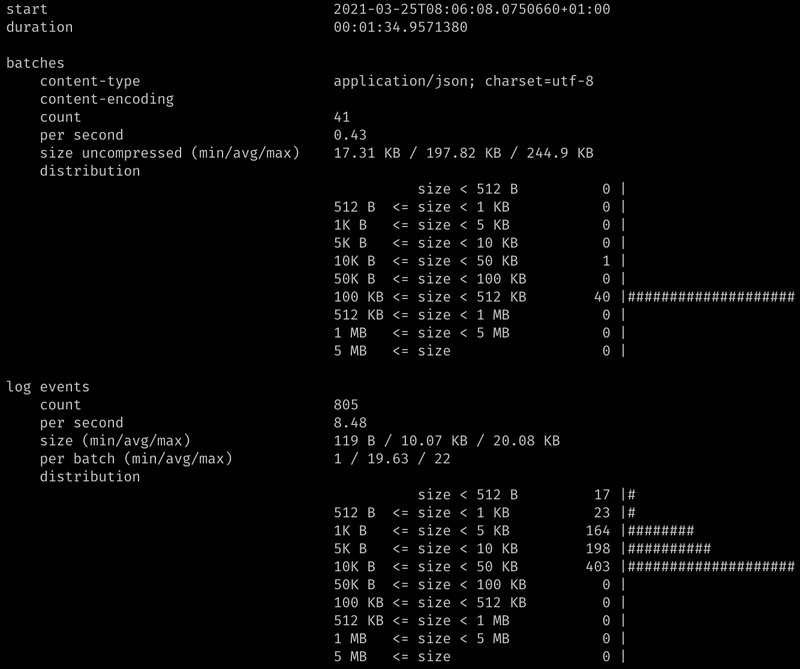

# Diagnostics for Serilog.Sinks.Http

This repository contains two applications. The first one is a console application configured to use [Serilog.Sinks.Http](https://github.com/FantasticFiasco/serilog-sinks-http), capable of sending log events over the network. The amount of log events, and their size, can be configured using arguments.



The second application is a ASP.NET Core application acting as a log server, capable of receiving log events sent by the console application. This log server is periodically printing information about received log events and their characteristics.



## Use-cases

The applications in the repository have been built to fulfil two use-cases.

### Use-case 1: Provide insights into the characteristics of your logging pattern

Do you know at which rate your application is producing log events? Do you know the average size of each log event? Are you sure that the buffer files won't overflow during peak load?

The HTTP sink can be configured in many ways, but if you are unaware of the logging behavior of your application you have a higher risk of using a configuration that doesn't suit your application. Get to know your application. Let your application send its log events to the log server and get insights into the logging characteristics of your application. Make sure you don't lose those log events during peak load.

### Use-case 2: Act as benchmark

Being able to control the amount of log events, and their size, lends itself well to provide a benchmark where we analyze the performance of the sink and the environment it acts within.

## Getting started using the console application

Run the following commands to start the console application producing log events.

```bash
cd ./src/app
dotnet run -- --help
dotnet run
```

## Getting started using the ASP.NET Core log server

Run the following command to start the log server.

```bash
cd ./src/log-server
dotnet run
```
