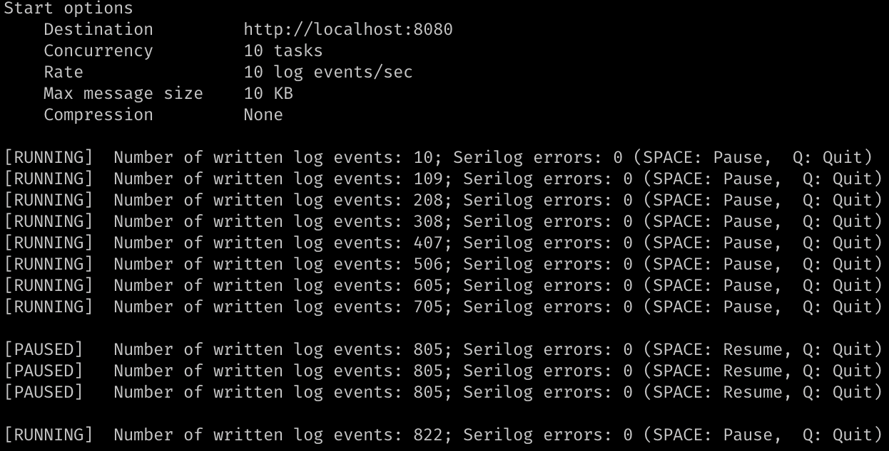

# Diagnostics for Serilog.Sinks.Http

This repository contains two applications. The first one is a console application configured to use [Serilog.Sinks.Http](https://github.com/FantasticFiasco/serilog-sinks-http), capable of producing log events. The amount of log events, and the size of these log events, can be configured using console arguments.

The second application is a ASP.NET Core application acting as a log server, receiving the log events sent by the console application. This log server is periodically printing information about received events and their characteristics.

## Use-cases

These two applications in the repository have been used to fulfil at least two use-cases.

## Use-case 1 - Act as benchmark

Being able to control the amount of log events, and their size, lends itself well to provide a benchmark where we analyze the performance of the sink and the environment it acts within. Running the applications can tell you whether your infrastructure lives up to the expectations given the amount of log events you are producing.

## Use-case 2 - Provide insight into the characteristics of your log events

TODO

The behavior of _Serilog.Sinks.Http_ is determined by its configuration. How often should we send a batch of log events over the network? How many buffer files should we use? Which size should the buffer files have?

to see the amount of events the sink can send ot

## Console app using the Serilog HTTP sink

The

## Log server receiving log events
